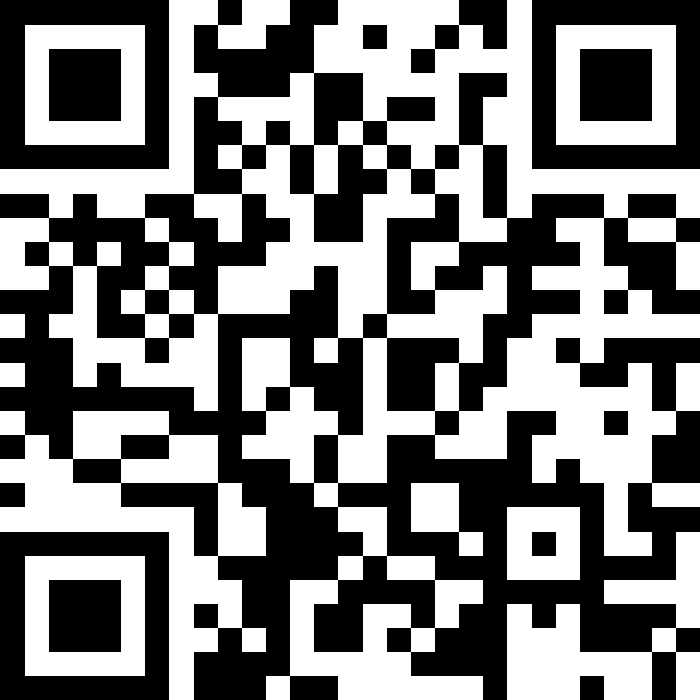

## Getting a PhD in Computer Science at University of Milano-Bicocca

**Prof. Gianluca Della Vedova**

*Director of the PhD Program in Computer Science*

 **More info**: 

 Questions! 

---

## What is a PhD?

- **Advanced research program**
- Production of new knowledge through original research.
- Training on research methods, technical training, interdisciplinary training, Responsible Research and Innovation, career development, and soft skills training.

---

## PhD Structure

- **Duration:** 3 years
- **Coursework:** 4 CS courses plus 3 interdisciplinary courses, 11 CFU overall.
- **Research:** A lot!
- **Publications:** Some
- **Doctoral Thesis:** One. Defended against an expert committee.

---

## Additional Information

- **Period abroad:** 6 months working abroad
- **PhD Scholarship:** approx €1,200/month.
- **Research budget**: approx €1,600/year plus supervisor funds.
- **Activities:** PhD talks, PhD colloquia, PhD day.

---

## A good PhD candidate is...

- Curious, eager to learn.
- Motivated in exploring new frontiers of knowledge.
- Interested in deepening expertise in a specific area.

## A good PhD candidate will...

- Become an internationally-recognized expert in a field.
- Collaborate globally.
- Build a professional network within academia and industry.

---

## A bad PhD candidate...

- Uses the PhD to delay job market entry
- Thinks that academia is the only career path
- Only wants to continue working on the thesis.

---

## The Selection Process

- Every year there is an open call (**NOW!**).
- CV and a short project proposal.
- A committee assesses the CV, the projects, interviews the candidates, and ranks them.
- A new cohort starts on November 1st.

---

## Post-PhD: Career Opportunities

*Cycle 34 (AlmaLaurea)*

- **Employment:** 100% of respondents are working.
- **Area of Employment:** 50% private sector, 50% public sector.
- **Research involvement on the job:** 75% a lot, 25% some.
- **Level of satisfaction:** 9 (on a 9-10 scale).

## More Info

Questions!

